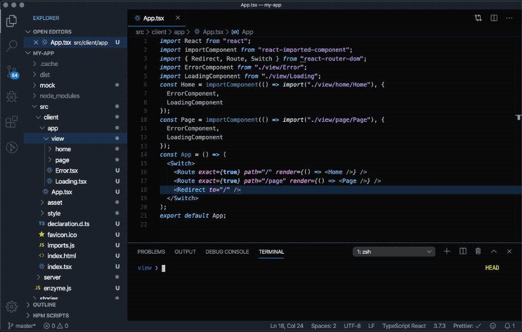

# rx

CLI for React projects built with Parcel.

## Install

```
npm i -g rctr
```

## Commands

Below are the avilable commands you can run with the `rx` cli.

### new

```
rx new my-app
```

`rx new` scaffolds a new app with support for SSR, lazyloading, i18n, SCSS, and more. We chose the kitchen sink approach.

For an example of what gets scaffolded, see [react-starter](https://github.com/steveblue/react-starter).

### generate

`rx generate` scaffolds code snippets in the directory the command is run. A list of arguments are below.



| type                    | file                                       |
| ----------------------- | ------------------------------------------ |
| fn-component, fc        | pure function component                    |
| arrow-fn-component, afc | arrow function component                   |
| component, c            | class component                            |
| view, v                 | class component with imported styles, test |
| ssr                     | server-side rendered view                  |
| test, t                 | spec file                                  |
| state, s                | state with reducer                         |
| context , ctx           | context                                    |

#### Example

`rx generate view Map`

- Map.tsx created
- Map.spec.tsx created
- Map.scss created

Some generators support optional arguments `--routing` and `--lazy`.

`rx g ssr About --routing --lazy`

- About.tsx created
- About.spec.tsx created
- About.scss created
- App.tsx has new routes

The first argument `--routing` adds a route to the nearest implementation of React Router.

```
<Route exact={true} path="/about" render={() => <About />} />
```

The second argument `--lazy` optionally lazyloads the component.

```
const About = importComponent(() => import("./view/about/About"));
```

## Development

If you want to contribute fork this repo, make your changes and submit a pull request.

To get started with development run `yarn install` and `yarn link`.
